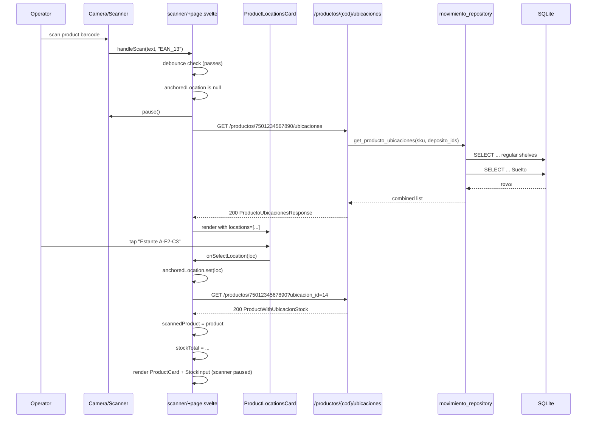
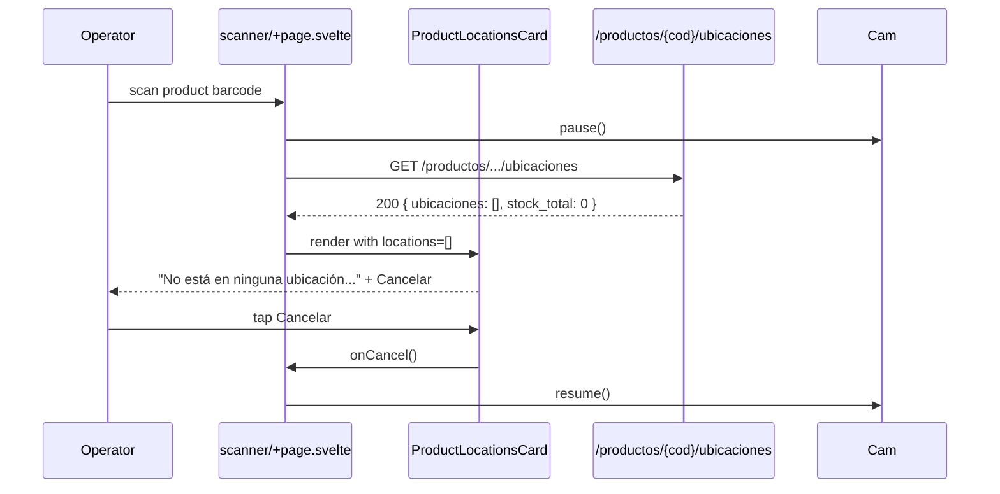
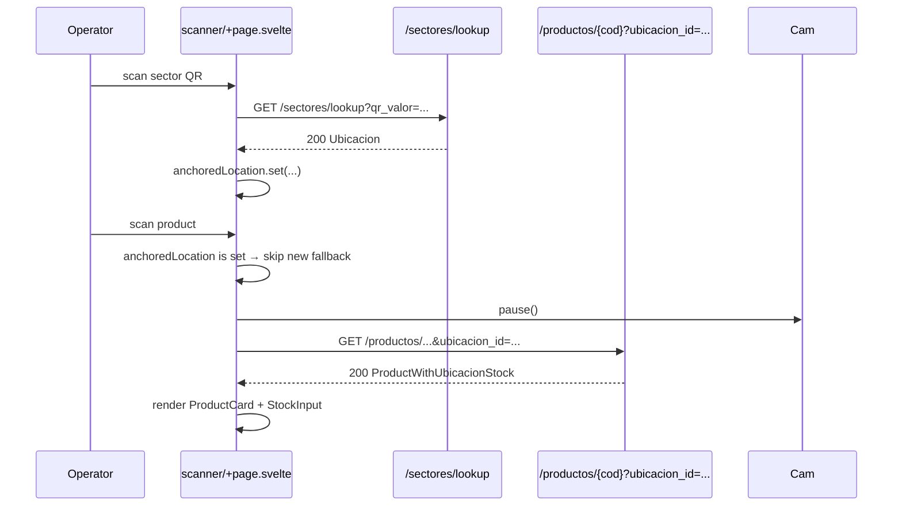

# SDD Design: product-locations-view

## 1. Executive Summary

When a product barcode is scanned without an anchored location, the scanner currently blocks with a red flash ("Escaneá un QR de sector primero"). This change replaces that block with a fallback flow: fetch every ubicacion where the product has stock (regular shelves via `ubicaciones.producto_id`, Suelto via SUM of `movimientos.cantidad`) filtered by the user's deposito permissions, render a tappable card list, anchor the chosen location, and seamlessly continue into the existing `ProductCard` + `StockInput` flow. The existing QR-first flow is untouched. No schema migrations, no new dependencies.

## 2. Backend Design

### 2.1 New endpoint — `GET /api/v1/productos/{codigo_de_barra}/ubicaciones`

Lives in `backend/app/api/v1/endpoints/productos.py`. The endpoint:

1. Calls `get_current_user` (existing dep) — 401 on missing/invalid token.
2. Resolves the product via `producto_repository.get_producto_by_codigo` — 404 `"Producto no encontrado"` if missing (matches existing pattern at `productos.py:80-85`).
3. Calls `get_deposito_ids_for_user(db, user)` (existing dep) — `None` for admins, `list[int]` for non-admins (may be empty).
4. Calls the new `movimiento_repository.get_producto_ubicaciones(db, sku, deposito_ids)`.
5. Returns the new `ProductoUbicacionesResponse` schema.

**No `require_deposito_access` per-row check** — permission filtering is centralized in the repository's `deposito_ids` parameter, mirroring how `list_movimientos` handles it (see `movimiento_repository.py:437-450`).

### 2.2 New repository function — `movimiento_repository.get_producto_ubicaciones`

```python
async def get_producto_ubicaciones(
    db: aiosqlite.Connection,
    producto_sku: str,
    deposito_ids: Optional[list[int]],
) -> list[dict]:
    """Return every ubicacion where `producto_sku` has stock, permission-filtered.

    Combines two sources into a single response:
      1. Regular shelves: `ubicaciones.producto_id = sku` with `stock = stock_actual`.
      2. Suelto: SUM of `movimientos.cantidad` for the product across Suelto
         ubicaciones (one Suelto row per deposito's Suelto estante with non-zero stock).

    Permission filtering: when `deposito_ids` is a non-empty list, the result
    is restricted to those depositos. Empty list returns no results. `None`
    (admin) returns everything.
    """
```

Implementation strategy — **two queries merged in Python** (cleaner than a SQL UNION with mixed column shapes, and SQLite has no native FULL OUTER JOIN):

```python
# 1. Regular shelves
regular_sql = """
    SELECT
        u.id AS ubicacion_id,
        e.nombre AS estante_nombre,
        u.qr_valor,
        u.fila,
        u.columna,
        u.stock_actual AS stock,
        d.id AS deposito_id,
        d.nombre AS deposito_nombre,
        'regular' AS source
    FROM ubicaciones u
    JOIN estantes e ON e.id = u.estante_id
    JOIN depositos d ON d.id = e.deposito_id
    WHERE u.producto_id = ?
      AND u.estado = 'activo'
      AND e.deleted_at IS NULL
"""
# Append deposito filter:
#   - deposito_ids is None: no filter (admin)
#   - deposito_ids is []  : no rows (return early)
#   - deposito_ids is [a,b]: " AND d.id IN (?, ?)"

# 2. Suelto (one row per Suelto estante with non-zero net movements)
suelto_sql = """
    SELECT
        u.id AS ubicacion_id,
        e.nombre AS estante_nombre,
        u.qr_valor,
        u.fila,
        u.columna,
        COALESCE(SUM(m.cantidad), 0) AS stock,
        d.id AS deposito_id,
        d.nombre AS deposito_nombre,
        'suelto' AS source
    FROM estantes e
    JOIN depositos d ON d.id = e.deposito_id
    JOIN ubicaciones u ON u.estante_id = e.id
    LEFT JOIN movimientos m ON m.ubicacion_id = u.id AND m.producto_id = ?
    WHERE e.nombre = 'Suelto'
      AND e.deleted_at IS NULL
    GROUP BY u.id, e.nombre, u.qr_valor, u.fila, u.columna, d.id, d.nombre
    HAVING stock != 0
"""
# Apply the same deposito filter on `d.id`.
```

**Why two queries, not UNION**: Suelto's stock is a SUM, regular's stock is a column — UNION would need a shared expression. The two-query approach is also more readable and matches the pattern in `get_producto_stock_total` (`movimiento_repository.py:407-434`) which already separates regular vs. Suelto.

**Why no new helper in `ubicacion_repository`**: the proposal mentions `list_ubicaciones_by_producto` there, but the function we need crosses the regular/Suelto boundary and belongs next to `_get_stock_anterior` (the Suelto-stock helper) in `movimiento_repository`. Keeping it in one place avoids a second repo call from the endpoint. The Suelto-location lookup is rare (1 row per deposito) so duplicating the small regular-shelf query is cheaper than two function calls.

**Suelto filter for `e.nombre = 'Suelto'`** — reuses the same convention as `_is_suelto` (`movimiento_repository.py:44-56`) and the existing `get_producto_stock_total` Suelto branch.

**Indexing**: existing `idx_ubicaciones_producto_id` (`002_create_indexes.sql:12`) covers the regular-shelf query. The Suelto query reads the small `estantes WHERE nombre = 'Suelto'` subset (typically 1 row per deposito), so no new index is required.

### 2.3 Permission filtering shape

The contract mirrors `list_movimientos` exactly:

| `deposito_ids` | Caller | Behavior |
|---|---|---|
| `None` | admin | No filter — all depositos |
| `[]` | non-admin, no access | Return `[]` immediately (no DB hit) |
| `[1, 2, 3]` | non-admin, restricted | `WHERE d.id IN (1, 2, 3)` via parameterized placeholders |

This matches the existing helper `get_deposito_ids_for_user` (`deps.py:57-68`) which returns `None` for admins and a list (possibly empty) for non-admins — so the endpoint never has to inspect `user.is_admin` directly.

### 2.4 New Pydantic schema

In `backend/app/schemas/productos.py`:

```python
class ProductoUbicacionItem(BaseModel):
    """One ubicacion where a product has stock."""

    ubicacion_id: int
    estante_nombre: str
    qr_valor: str
    fila: int
    columna: int
    stock: int
    deposito_nombre: str


class ProductoUbicacionesResponse(BaseModel):
    """All ubicaciones where a product has stock, plus total."""

    sku: str
    descripcion: str
    codigo_de_barra: str
    stock_total: int
    ubicaciones: list[ProductoUbicacionItem]
```

`stock_total` is the sum of `stock` across returned items (computed in the endpoint, not in SQL, so it matches the permission-filtered view).

### 2.5 No migration, no new dependencies

- No schema changes — the existing `productos`, `ubicaciones`, `estantes`, `depositos`, `movimientos` tables already support the query.
- No new Python packages — only `aiosqlite`, `fastapi`, `pydantic` which are already in use.
- No router registration change — the endpoint is added to the existing `productos` router, already included in `api/v1/__init__.py`.

## 3. Frontend Design

### 3.1 New component — `frontend/src/lib/components/ProductLocationsCard.svelte`

A pure presentational card that displays the lookup result and emits selection/cancel events. No fetch logic — the parent owns the network call.

**Props (Svelte 5 `$props()` runes):**

```ts
interface Props {
  product: { sku: string; descripcion: string; stock_total: number };
  locations: ProductoUbicacionItem[];
  onSelectLocation: (location: ProductoUbicacionItem) => void;
  onCancel: () => void;
}
```

**Render contract:**

| Condition | UI |
|---|---|
| `locations.length > 0` | Product header (SKU + descripcion + `stock_total` badge). Tappable location list. "Cancelar" button. |
| `locations.length === 0` | "No está en ninguna ubicación. Escaneá un QR de sector para asignarlo." + "Cancelar" button. |

**Each location card displays:**

- `estante_nombre` (large) + `qr_valor` (mono)
- `F{fila}-C{columna}` tag
- `deposito_nombre` (muted)
- `stock` (right-aligned, bold, color-coded: green for >0, muted for 0)
- For Suelto rows: `estante_nombre === 'Suelto'` → render a small "Suelto" pill instead of F-C tag

**Interaction:**

- Whole card is a `<button>` (min 48×48 px per `Frontend Responsive Design Standards` skill) → calls `onSelectLocation(location)`.
- "Cancelar" button at the bottom → calls `onCancel()`.
- No keyboard/scroll trapping — the parent page already handles pause/resume of the camera.

**Styling:** reuses the existing color palette (`#f0fdf4`/`#bbf7d0` green outline from `ProductCard.svelte:81-84` for product cards, `#f1f5f9` neutral for buttons) so the new card looks like a sibling of the existing `ProductCard` and `LocationModal`.

### 3.2 Scanner page changes — `frontend/src/routes/scanner/+page.svelte`

Three localized edits; the existing flow is not restructured.

**Edit 1 — import the new component and API helper:**

```ts
import ProductLocationsCard from '$lib/components/ProductLocationsCard.svelte';
import { getProductoUbicaciones } from '$lib/api/client';
import type { ProductoUbicacionItem, ProductoUbicacionesResponse } from '$lib/api/client';
```

**Edit 2 — add state for the locations view (reuses `anchoredLocation` instead of a new store):**

```ts
let locationsProduct = $state<ProductoUbicacionesResponse | null>(null);
let locationsList = $state<ProductoUbicacionItem[]>([]);
let showLocationsCard = $state(false);
let locationsLoading = $state(false);
let scannedBarcodePending = $state(''); // remembered barcode awaiting location selection
```

**Edit 3 — `handleProductScan` branch when no anchored location:**

Replaces the current `showError('Escaneá un QR de sector primero...')` early-return at `+page.svelte:113-117` with:

```ts
if (!location) {
  // Debounce already applied by handleScan.
  scannerRef?.pause();
  locationsLoading = true;
  scannedBarcodePending = barcode;
  showLocationsCard = true;
  try {
    const result = await getProductoUbicaciones(barcode);
    locationsProduct = result;
    locationsList = result.ubicaciones;
  } catch (err) {
    if (err instanceof ApiError && err.status === 404) {
      showError('Producto no encontrado');
    } else {
      showError(`Error al buscar producto: ${barcode}`);
    }
    showLocationsCard = false;
    scannerRef?.resume();
  } finally {
    locationsLoading = false;
  }
  return;
}
```

**Edit 4 — new handlers:**

```ts
async function handleSelectLocation(loc: ProductoUbicacionItem) {
  showLocationsCard = false;
  // Anchor the chosen location — same shape as selectUbicacion / handleSectorScan.
  const anchored: AnchoredLocation = {
    ubicacion_id: loc.ubicacion_id,
    estante_nombre: loc.estante_nombre,
    qr_valor: loc.qr_valor,
    fila: loc.fila,
    columna: loc.columna
  };
  anchoredLocation.set(anchored);
  // Now load the product WITH stock for the newly-anchored location —
  // this reuses the existing getProductoByBarcodeWithStock path.
  try {
    const product = await getProductoByBarcodeWithStock(scannedBarcodePending, loc.ubicacion_id);
    if (!product) {
      showError('Producto no encontrado al anclar ubicación');
      return;
    }
    scannedProduct = product;
    quantity = 0;
    mode = 'alta';
    try {
      const stockInfo = await getProductoStockTotal(product.sku);
      stockTotal = stockInfo.stock_total;
    } catch {
      stockTotal = 0;
    }
  } catch (err) {
    showError(`Error al cargar producto: ${scannedBarcodePending}`);
  }
}

function handleCancelLocations() {
  showLocationsCard = false;
  locationsProduct = null;
  locationsList = [];
  scannerRef?.resume();
}
```

**Edit 5 — render the card:**

In the template, after the `lastScan` div and before the `{#if scannedProduct}` block:

```svelte
{#if showLocationsCard}
  <ProductLocationsCard
    product={locationsProduct ?? { sku: scannedBarcodePending, descripcion: '...', stock_total: 0 }}
    locations={locationsList}
    onSelectLocation={handleSelectLocation}
    onCancel={handleCancelLocations}
  />
{/if}
```

**Critical guarantee — existing QR-first flow unchanged:**

The early `if (!location)` block is the ONLY code path being modified. The downstream `if (location)` branch (`+page.svelte:118-147`) is byte-identical to the current behavior. Anchored-location scans skip the new flow entirely.

### 3.3 API client additions — `frontend/src/lib/api/client.ts`

**Types (alongside existing product types around line 277):**

```ts
export interface ProductoUbicacionItem {
  ubicacion_id: number;
  estante_nombre: string;
  qr_valor: string;
  fila: number;
  columna: number;
  stock: number;
  deposito_nombre: string;
}

export interface ProductoUbicacionesResponse {
  sku: string;
  descripcion: string;
  codigo_de_barra: string;
  stock_total: number;
  ubicaciones: ProductoUbicacionItem[];
}
```

**Function (alongside `getProductoStockTotal` at line 411):**

```ts
export async function getProductoUbicaciones(
  codigo: string
): Promise<ProductoUbicacionesResponse> {
  return api<ProductoUbicacionesResponse>(
    `/productos/${encodeURIComponent(codigo)}/ubicaciones`
  );
}
```

Throws `ApiError` on 404 / 403 / network failure — the existing `api<T>()` helper handles 401 redirects and message extraction (`client.ts:37-65`).

### 3.4 State machine

```
                    ┌───────────────────────────────────────────┐
                    │                                           │
                    ▼                                           │
              ┌──────────┐  QR  ┌────────────────────┐  product ┌─────────────────┐
   start ──▶  │  IDLE    │ ───▶ │ LOCATION_ANCHORED  │ ───────▶ │ PRODUCT_FOUND   │
              │ (camera  │      │  (scanner active)  │          │ (scanner paused)│
              │  active) │      └────────────────────┘          └────────┬────────┘
              └────┬─────┘                                               │
                   │ product (no location)                               │ save
                   │                                                     ▼
                   ▼                                              ┌──────────┐
            ┌──────────────────┐   tap location                   │  STOCK   │
            │ SHOWING_LOCATIONS│ ───────────────────────────▶     │  ENTRY   │
            │ (scanner paused) │                                  └────┬─────┘
            └────────┬─────────┘                                       │ ok
                     │ Cancelar                                       ▼
                     │                                          ┌──────────┐
                     └────────────────────────────────────▶     │ SCANNING │
                                                                │ (resume) │
                                                                └──────────┘
```

**Transitions:**

| From | Event | To | Notes |
|---|---|---|---|
| `IDLE` | QR scan | `LOCATION_ANCHORED` | Existing — `handleSectorScan` |
| `LOCATION_ANCHORED` | Product scan | `PRODUCT_FOUND` | Existing — `handleProductScan` (location present) |
| `PRODUCT_FOUND` | Save success | `SCANNING` (resume) | Existing — `handleSave` |
| `IDLE` | Product scan (no location) | `SHOWING_LOCATIONS` | **NEW** — replaces red flash |
| `SHOWING_LOCATIONS` | Tap location | `LOCATION_ANCHORED` → `PRODUCT_FOUND` | **NEW** — `handleSelectLocation` |
| `SHOWING_LOCATIONS` | Cancelar | `IDLE` (resume scan) | **NEW** — `handleCancelLocations` |
| `SHOWING_LOCATIONS` | 404 from endpoint | `IDLE` + red flash "Producto no encontrado" | **NEW** — error branch |

`scannerState` store stays at `paused` while in `SHOWING_LOCATIONS`, `PRODUCT_FOUND`, or `STOCK_ENTRY` — same lifecycle the existing flow already implements.

## 4. File Changes

| File | Action | Description |
|---|---|---|
| `backend/app/repositories/movimiento_repository.py` | Modify | Add `get_producto_ubicaciones(db, sku, deposito_ids)` (~50 lines) |
| `backend/app/schemas/productos.py` | Modify | Add `ProductoUbicacionItem` + `ProductoUbicacionesResponse` (~15 lines) |
| `backend/app/api/v1/endpoints/productos.py` | Modify | Add `GET /{codigo_de_barra}/ubicaciones` endpoint (~30 lines) |
| `frontend/src/lib/api/client.ts` | Modify | Add types + `getProductoUbicaciones` (~25 lines) |
| `frontend/src/lib/components/ProductLocationsCard.svelte` | Create | Tappable card list, presentational (~150 lines including styles) |
| `frontend/src/routes/scanner/+page.svelte` | Modify | Add 5 state vars + 2 handlers + 1 render block + edit `handleProductScan` (~80 net new lines) |

**No changes to:** `ubicacion_repository.py`, `usuario_repository.py`, `deps.py`, `estantes.py`, `sectores.py`, any migration, any test, the existing `ProductCard.svelte`, `StockInput.svelte`, `Scanner.svelte`, session store, or anchored-location store.

## 5. API Contract

**Request**

```
GET /api/v1/productos/7501234567890/ubicaciones
Authorization: Bearer <token>
```

**Response 200 (product with two regular shelves)**

```json
{
  "sku": "P-1",
  "descripcion": "Caja de tornillos 1/4\"",
  "codigo_de_barra": "7501234567890",
  "stock_total": 25,
  "ubicaciones": [
    {
      "ubicacion_id": 14,
      "estante_nombre": "Estante A",
      "qr_valor": "Estante A-F2-C3",
      "fila": 2,
      "columna": 3,
      "stock": 15,
      "deposito_nombre": "Depósito Central"
    },
    {
      "ubicacion_id": 22,
      "estante_nombre": "Estante B",
      "qr_valor": "Estante B-F1-C5",
      "fila": 1,
      "columna": 5,
      "stock": 10,
      "deposito_nombre": "Depósito Central"
    }
  ]
}
```

**Response 200 (Suelto only)**

```json
{
  "sku": "P-2",
  "descripcion": "Tuercas varias",
  "codigo_de_barra": "7509876543210",
  "stock_total": 5,
  "ubicaciones": [
    {
      "ubicacion_id": 1,
      "estante_nombre": "Suelto",
      "qr_valor": "Suelto",
      "fila": 1,
      "columna": 1,
      "stock": 5,
      "deposito_nombre": "Depósito Central"
    }
  ]
}
```

**Response 200 (no locations)**

```json
{ "sku": "P-3", "descripcion": "...", "codigo_de_barra": "...", "stock_total": 0, "ubicaciones": [] }
```

**Response 404**

```json
{ "detail": "Producto no encontrado" }
```

**Response 401** — standard `clearSession()` redirect (handled in `client.ts:37-43`).

**Response 403** — only if deposito filtering logic ever short-circuits badly; not expected for valid users (an empty `deposito_ids` list returns 200 with empty array per spec).

## 6. Architecture Decisions

### ADR-001: Two queries + Python merge, not a SQL UNION

**Decision:** `get_producto_ubicaciones` runs two parameterized SELECTs (regular shelves, Suelto) and merges in Python.

**Rationale:** Regular-shelf stock is a column (`ubicaciones.stock_actual`); Suelto stock is `SUM(movimientos.cantidad)`. A SQL UNION would need a shared expression (e.g., `SELECT stock FROM ubicaciones UNION ALL SELECT SUM(...) FROM movimientos`) and force null-padded columns. The two-query pattern is already proven in `get_producto_stock_total` (`movimiento_repository.py:407-434`) and is easier to read. The cost is one extra round-trip — negligible for a 1–5 row result set (warehouse products typically have 1–3 locations).

### ADR-002: Function lives in `movimiento_repository`, not `ubicacion_repository`

**Decision:** Despite the name, the function is added to `movimiento_repository.py` next to the Suelto-stock helpers.

**Rationale:** The Suelto half of the query is the hard part (it aggregates `movimientos`). `movimiento_repository` already owns the Suelto convention (`e.nombre = 'Suelto'`, `_get_stock_anterior`). Splitting across two repositories would require either a cross-repo import or duplicating the Suelto logic. Single source of truth wins.

### ADR-003: No new store, reuse `anchoredLocation`

**Decision:** The new flow reuses the existing `anchoredLocation` store from `$lib/stores/scanner.ts`.

**Rationale:** `AnchoredLocation` already carries the exact shape the `ProductCard` + `StockInput` flow needs (ubicacion_id, estante_nombre, qr_valor, fila, columna). Adding a second "candidate location" store would force every existing consumer to choose between them. The selection handler writes the same shape as `selectUbicacion` (`scanner/+page.svelte:307-319`) — no consumer needs to know whether the location came from a QR, a modal selection, or the locations card.

### ADR-004: Debounce is owned by the parent (`handleScan`), not the card

**Decision:** The 2-second debounce on duplicate scans stays in the existing `handleScan` (`scanner/+page.svelte:74-88`). The new branch reuses it without modification.

**Rationale:** The debounce protects the camera-level event stream. Adding a second debounce inside the locations flow would either be redundant or risk a race. The spec explicitly requires the debounce to apply to the fallback flow — it does, transparently, because the fallback only fires from inside `handleScan`.

### ADR-005: Empty-locations case shows the spec-defined copy, not a generic "no results"

**Decision:** When the endpoint returns `ubicaciones: []`, the card shows the exact spec-mandated message: "No está en ninguna ubicación. Escaneá un QR de sector para asignarlo."

**Rationale:** This is the user-facing moment where the operator learns the next step. Generic copy would push the burden back to the operator. The spec is explicit, and the existing `showError` for 404 covers the "product doesn't exist at all" case separately.

## 7. Testing Strategy

The project has no existing test infrastructure (`openspec/config.yaml` shows `test_command: ""` and `coverage_threshold: 0`), so the focus is on manual verification of the critical paths.

| Layer | What to Verify | How |
|---|---|---|
| Backend | Two regular shelves returned with correct stocks | Seed a product in two ubicaciones, hit endpoint, assert `stock_total` and `ubicaciones` |
| Backend | Suelto only — SUM of movements shown | Seed movements in Suelto, no regular assignment, assert single Suelto row |
| Backend | Empty locations returns 200 with `[]` | Seed a product with no assignments and no movements |
| Backend | 404 on unknown barcode | Hit endpoint with random non-existing code |
| Backend | Admin sees all depositos | Create product in 2 depositos, hit as admin |
| Backend | Non-admin sees only accessible depositos | Same seed, hit as operator with one deposito assignment |
| Backend | Non-admin with no access gets `[]` | Hit as operator with no deposito assignments |
| Frontend | QR-first flow unchanged | Scan QR → scan product → existing ProductCard flow works byte-identically |
| Frontend | Fallback shows card | Scan product with no anchored location → card appears with 1+ tappable rows |
| Frontend | Tap anchors and shows ProductCard | Tap a row → `ProductCard` + `StockInput` appear, location is anchored, scanner paused |
| Frontend | Cancelar returns to scanning | Tap Cancelar → card disappears, scanner resumes, no location anchored |
| Frontend | Empty state copy | Create a product with no locations, scan it → "No está en ninguna ubicación..." message + Cancelar |
| Frontend | 404 flash | Scan unknown barcode → red flash "Producto no encontrado" |
| Frontend | Debounce still applies | Scan same product twice within 2s → only one fetch |

## 8. Migration / Rollout

**No migration required.** No schema changes, no new indexes needed (`idx_ubicaciones_producto_id` already exists from migration 002).

**Rollout:** additive — drop the new endpoint, remove the new component, revert the `handleProductScan` early-return, delete the API client function. Zero risk to existing flows because every modified path has a fallback (the QR-first flow doesn't touch the new code).

## 9. Risk Forecast

| Risk | Likelihood | Impact | Mitigation |
|---|---|---|---|
| Two queries are slower than a single UNION | Low | Low | Result set is 1–5 rows; one extra round-trip is negligible. Already proven in `get_producto_stock_total`. |
| Operator taps wrong location, anchors to a non-target shelf | Medium | Medium | Anchored location can be cleared with the existing "Quitar" button. `ProductCard` shows the QR/fila/columna so the operator can self-correct before saving. |
| Suelto row duplicated if multiple depositos each have a Suelto shelf | Low | Low | Spec allows this — one row per (estante, deposito) with its own `stock`. The card shows `deposito_nombre` so operators can disambiguate. |
| `deposito_ids = []` returns no results even when product exists in other depositos | None (by design) | None | Matches the spec exactly: "an empty permission list MUST yield an empty `ubicaciones` list". |
| `scannerRef.pause()` not called while card is shown | Low | Medium | Reuse the same pause call as the existing `handleProductScan` (line 119). The card render is gated by `showLocationsCard` which is only set after pause. |
| Race between debounce expiry and card display | Low | Low | `scannedBarcodePending` is set in the same synchronous block as `showLocationsCard = true`; a debounced re-scan can't reset them mid-flight because the second scan is ignored entirely. |
| Product with thousands of Suelto movements slow SUM | Very low | Low | Suelto is typically a handful of movements per product; covered by the existing `idx_movimientos_producto_id` index. |

### Sizing

- Backend: ~80–120 lines (repository function ~50, schema ~15, endpoint ~30, minor adjustments).
- Frontend: ~150–250 lines (new component ~150, scanner edits ~80, API client ~25).
- Total: ~230–370 lines — comfortably under the 400-line chained-PR threshold.

**Delivery recommendation:** single PR. The change is small, fully additive, has no DB migration, and the existing QR-first flow is provably untouched (no shared code paths in the modified branch). A second chained PR would add reviewer overhead with no isolation benefit.

## 10. Sequence Diagrams

### 10.1 Product scanned with no anchored location — locations found



### 10.2 Product scanned with no anchored location — no locations



### 10.3 Existing QR-first flow — UNCHANGED



This flow has zero code changes — verified by diff scope (only the `if (!location)` branch is modified, the `if (location)` branch is byte-identical).

## 11. Skill & Documentation Resolution

| Technology | Source | Key guidance applied |
|---|---|---|
| FastAPI async endpoint + DI | `fastapi-templates` skill | Router lives in `endpoints/`, schema in `schemas/`, async repo call inside handler, `Depends` injection for `get_current_user` and `get_db`. |
| SQLite parameterized queries | `SQLite Database Expert` skill | All `?` placeholders, no string interpolation, `JOIN` order favors `producto_id` filter for index use. |
| SvelteKit structure | `sveltekit-structure` skill | `+page.svelte` route edits, no new route needed. New component in `lib/components/`. State stays in the page (`$state` runes), not in a new store. |
| Mobile-first responsive UI | `Frontend Responsive Design Standards` skill | Tappable cards ≥ 48×48 px, stacked layout, color contrast for outdoor warehouse lighting. |
| Existing patterns | `user-permissions` design precedent | Reused the `get_deposito_ids_for_user` pattern, response model naming (`XxxResponse`), and `deposito_ids=None/[]/[...]` filtering contract verbatim. |
