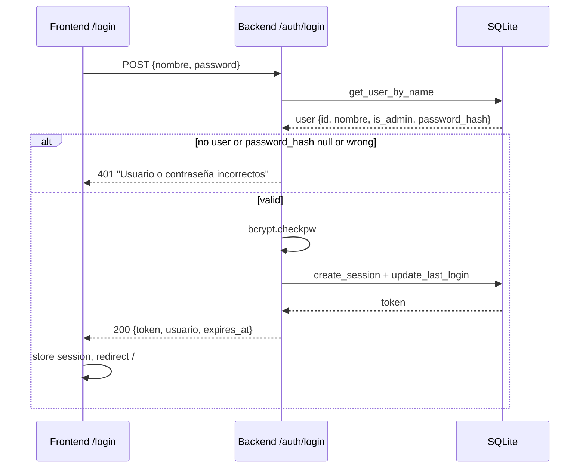
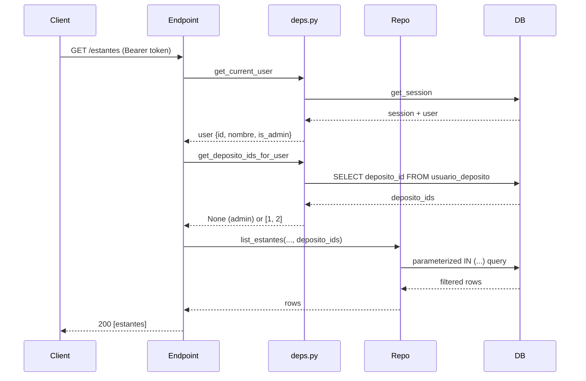
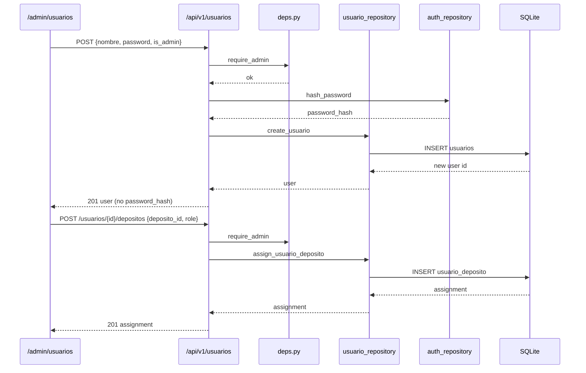

# SDD Design: user-permissions

## 1. Executive Summary

Replace the current name-only login with username + password authentication using `bcrypt`, add a global `is_admin` flag, and introduce a `usuario_deposito` junction table that assigns each user a role (`admin`, `operator`, or `viewer`) per depósito. Permission helpers live in `app.api.v1.deps` and are reused by every protected endpoint. List endpoints filter data at the repository layer by the user's accessible depósito IDs; resource endpoints verify the resource's depósito before mutating or returning it. The frontend login page is rewritten, a new `/admin/usuarios` page is added, and navigation/scanner UI become permission-aware.

## 2. Migration Design

All schema changes are delivered as versioned migrations under `backend/migrations/`. The existing migration runner (`backend/app/core/migrations.py`) executes `.sql` files. Because `bcrypt` hashing cannot be expressed in SQLite SQL, Migration 011 is delivered as a Python migration callable registered alongside the SQL migrations.

### 2.1 Migration 009 — Add password and admin columns to `usuarios`

`backend/migrations/009_add_password_and_admin_to_usuarios.sql`

```sql
ALTER TABLE usuarios ADD COLUMN password_hash TEXT;
ALTER TABLE usuarios ADD COLUMN is_admin BOOLEAN NOT NULL DEFAULT 0;
```

- `password_hash` is nullable to support legacy users until an admin sets a password.
- `is_admin` defaults to `0`; global admins are explicit.

### 2.2 Migration 010 — Create `usuario_deposito` junction table

`backend/migrations/010_create_usuario_deposito.sql`

```sql
CREATE TABLE IF NOT EXISTS usuario_deposito (
    id INTEGER PRIMARY KEY AUTOINCREMENT,
    usuario_id INTEGER NOT NULL REFERENCES usuarios(id) ON DELETE CASCADE,
    deposito_id INTEGER NOT NULL REFERENCES depositos(id) ON DELETE CASCADE,
    role TEXT NOT NULL CHECK (role IN ('admin', 'operator', 'viewer')),
    created_at TEXT DEFAULT CURRENT_TIMESTAMP,
    UNIQUE (usuario_id, deposito_id)
);

CREATE INDEX idx_usuario_deposito_usuario ON usuario_deposito(usuario_id);
CREATE INDEX idx_usuario_deposito_deposito ON usuario_deposito(deposito_id);
```

### 2.3 Migration 011 — Seed existing users with permissions

Because the seed needs to call `bcrypt`, implement it as a Python migration:

`backend/migrations/011_seed_user_permissions.py`

```python
import os

import bcrypt

DEFAULT_ADMIN_PASSWORD = os.environ.get("DEFAULT_ADMIN_PASSWORD", "admin123")
OPERARIO_PASSWORD = os.environ.get("DEFAULT_OPERARIO_PASSWORD", "operario123")


async def run(connection) -> None:
    admin_hash = bcrypt.hashpw(
        DEFAULT_ADMIN_PASSWORD.encode("utf-8"), bcrypt.gensalt()
    ).decode("utf-8")
    op_hash = bcrypt.hashpw(
        OPERARIO_PASSWORD.encode("utf-8"), bcrypt.gensalt()
    ).decode("utf-8")

    await connection.execute(
        "UPDATE usuarios SET is_admin = 1, password_hash = ? WHERE nombre = ?",
        (admin_hash, "Admin"),
    )

    for op_name in ("Operario 1", "Operario 2"):
        await connection.execute(
            """
            UPDATE usuarios
            SET is_admin = 0, password_hash = ?
            WHERE nombre = ?
            """,
            (op_hash, op_name),
        )
        await connection.execute(
            """
            INSERT OR IGNORE INTO usuario_deposito (usuario_id, deposito_id, role)
            VALUES (
                (SELECT id FROM usuarios WHERE nombre = ?),
                1,
                'operator'
            )
            """,
            (op_name,),
        )

    await connection.commit()
```

The runner in `backend/app/core/migrations.py` is extended to support a callable migration entry for version 11:

```python
MIGRATIONS: list[tuple[int, str, str | Callable]] = [
    ...,
    (11, "seed_user_permissions", _load_migration_py("011_seed_user_permissions.py")),
]
```

> **Warning:** The seeded passwords above are temporary. The production deploy checklist must require the admin to change them before real use (see ADR-005).

## 3. Auth Repository Changes

`backend/app/repositories/auth_repository.py`

| Function | Change |
|----------|--------|
| `get_user_by_name(db, nombre)` | Also select `password_hash` and `is_admin`. Return `None` when not found. |
| `get_session(db, token)` | Join `usuarios.is_admin` into the session row so `get_current_user` does not need a second query. |
| `create_session(db, usuario_id)` | Unchanged. |
| `update_last_login(db, usuario_id)` | Unchanged. |
| `delete_session(db, token)` | Unchanged. |
| `hash_password(password: str) -> str` | New. `bcrypt.hashpw(password.encode("utf-8"), bcrypt.gensalt()).decode("utf-8")`. |
| `verify_password(password: str, password_hash: str) -> bool` | New. `bcrypt.checkpw(password.encode("utf-8"), password_hash.encode("utf-8"))`. |

Context7 verified (`/pyca/bcrypt`):
- `bcrypt.hashpw(...)` returns `bytes`.
- `bcrypt.checkpw(...)` returns `bool` and requires both arguments as `bytes`.
- Store hashes as SQLite `TEXT` by decoding the bytes with `.decode("utf-8")`.

## 4. Permission Dependencies (`deps.py`)

`backend/app/api/v1/deps.py` is the single source of truth for authentication and authorization.

```python
from dataclasses import dataclass

@dataclass
class UsuarioResponse:
    id: int
    nombre: str
    is_admin: bool
```

Functions to add/modify:

- **`get_current_user(...)`** — Validate the Bearer token using `auth_repository.get_session`. Return `UsuarioResponse(id, nombre, is_admin)` from the session row.
- **`require_admin(user = Depends(get_current_user))`** — Raise `HTTPException(403)` if `not user.is_admin`.
- **`get_deposito_ids_for_user(db, user) -> Optional[list[int]]`** — Return `None` for global admins (no filtering). For non-admins, query `usuario_deposito` and return the list of `deposito_id`s (may be empty).
- **`require_deposito_access(user, deposito_id, db)`** — Raise `HTTPException(403)` if the user is not an admin and `deposito_id` is not in their accessible set. Resources with `deposito_id = NULL` are denied to non-admins.
- **`require_deposito_role(user, deposito_id, db, allowed_roles: set[str])`** — Like `require_deposito_access`, but also verifies the user's role for that depósito is one of `allowed_roles`. Used for write endpoints (`POST /movimientos`, `POST /estantes`, assign/unassign).

Role ordering is implicit in the caller: `{"admin", "operator"}` permits both; `{"admin"}` permits only depósito admins.

## 5. Repository Changes for Permission Filtering

### 5.1 `estante_repository.py`

- `list_depositos(db)` remains but will be filtered by the endpoint for non-admins.
- `list_estantes(db, include_deleted, deposito_id, deposito_ids: Optional[list[int]] = None)`:
  - If `deposito_ids` is `None` (admin), no extra filter.
  - If `deposito_ids` is `[]`, return empty.
  - Else add `e.deposito_id IN (?, ?, ...)` with parameterized placeholders.
- `get_estante_by_id(...)` includes `e.deposito_id` in the returned row.

### 5.2 `movimiento_repository.py`

- `list_movimientos(db, filters, deposito_ids: Optional[list[int]] = None)`:
  - Join `movimientos -> ubicaciones -> estantes`.
  - If `deposito_ids` is provided, add `e.deposito_id IN (...)` to the `WHERE` clause for both the count and the paginated query.
- `export_movimientos_csv(db, filters, deposito_ids)` applies the same filter.
- `get_movimiento_by_id(...)` already joins through `ubicaciones`/`estantes`; add `e.deposito_id` to the row so the endpoint can verify access if needed.

### 5.3 `ubicacion_repository.py`

- `get_ubicacion_by_qr(...)` must return the resource's `deposito_id` by joining `estantes`:
  ```sql
  SELECT u.*, e.nombre AS estante_nombre, e.deposito_id
  FROM ubicaciones u
  JOIN estantes e ON e.id = u.estante_id
  WHERE u.qr_valor = ? AND u.estado = 'activo' AND e.deleted_at IS NULL
  ```
- `get_ubicacion_by_id(...)` also includes `e.deposito_id`.
- `list_ubicaciones_by_estante(...)` remains unchanged; the caller must first verify the estante's depósito is accessible.

## 6. Endpoint Changes

### 6.1 `auth.py`

- `POST /auth/login`
  - Request body: `LoginRequest(nombre: str, password: str)`.
  - Fetch user with `get_user_by_name`.
  - If user not found or password wrong → `401` `"Usuario o contraseña incorrectos"`.
  - If `password_hash` is `NULL` → `401` `"Usuario sin contraseña configurada. Contacte al administrador."`.
  - On success create session, update `last_login_at`, return `token`, `expires_at`, and `usuario: {id, nombre, is_admin}`.
- `GET /auth/me`
  - Return `usuario: {id, nombre, is_admin}` and `depositos: [{deposito_id, nombre, role}]`.
  - `password_hash` is never included.
- `POST /auth/logout` unchanged.

### 6.2 `usuarios.py` (rewritten)

Replace the public list endpoint with admin-only CRUD and depósito assignment.

| Method | Path | Auth | Notes |
|--------|------|------|-------|
| GET | `/api/v1/usuarios` | `require_admin` | List users with assignments, no `password_hash`. |
| POST | `/api/v1/usuarios` | `require_admin` | Body `{nombre, password, is_admin}`. Hash password. Duplicate `nombre` → `409`. |
| PUT | `/api/v1/usuarios/{id}` | `require_admin` | Body `{nombre?, password?, is_admin?}`. Re-hash password if provided. |
| DELETE | `/api/v1/usuarios/{id}` | `require_admin` | Hard delete. Reject self-deletion (`400`). Reject last admin deletion (`400`). `usuario_deposito` rows cascade. |
| GET | `/api/v1/usuarios/{id}/depositos` | `require_admin` | Return `[{deposito_id, nombre, role}]`. |
| POST | `/api/v1/usuarios/{id}/depositos` | `require_admin` | Body `{deposito_id, role}`. Duplicate → `409`. |
| DELETE | `/api/v1/usuarios/{id}/depositos/{deposito_id}` | `require_admin` | Remove assignment. |

### 6.3 `estantes.py`

- `GET /estantes` — call `get_deposito_ids_for_user`, pass to `list_estantes`.
- `GET /estantes/{id}` — after fetch, call `require_deposito_access` using `estante.deposito_id`.
- `POST /estantes` — verify `deposito_id` is accessible and user has `admin` role for that depósito (or is global admin).
- `PUT /estantes/{id}` — verify depósito access.
- `DELETE /estantes/{id}` — verify depósito access.
- `GET /estantes/{id}/ubicaciones` — verify depósito access.
- `GET /estantes/{id}/qrs` and `/qrs/print` — verify depósito access.
- `GET /depositos` (sub-router) — return only accessible depósitos for non-admins; admins see all.

### 6.4 `movimientos.py`

- `GET /movimientos` — filter by user's `deposito_ids`.
- `GET /movimientos/export` — apply the same filter.
- `GET /movimientos/{id}` — verify the movement's depósito is accessible.
- `POST /movimientos`:
  1. Load the ubicación (including `deposito_id`).
  2. `require_deposito_role(..., allowed_roles={"admin", "operator"})`.
  3. Call `movimiento_repository.create_movimiento`.

### 6.5 `sectores.py`

- `GET /sectores/lookup?qr_valor=...` — after locating the ubicación, call `require_deposito_access`. Return `403` for unauthorized depósitos so the scanner can show the permission error.

### 6.6 `ubicaciones.py`

- `PUT /ubicaciones/{id}/assign` — verify depósito access and write role (`admin`/`operator`).
- `DELETE /ubicaciones/{id}/assign` — verify depósito access and write role.
- `GET /ubicaciones/{id}/qr.png` — verify depósito access.

### 6.7 `import_.py`

- `POST /import/excel` — require global admin (`require_admin`).

## 7. Frontend Design

### 7.1 `session.ts`

Extend the store type:

```ts
export interface UsuarioSession {
  id: number;
  nombre: string;
  is_admin: boolean;
}

export interface DepositoAssignment {
  deposito_id: number;
  nombre: string;
  role: 'admin' | 'operator' | 'viewer';
}

export interface UserSession {
  token: string;
  usuario: UsuarioSession;
  depositos: DepositoAssignment[];
  expires_at: string;
}
```

Update `setSession(token, usuario, expires_at)` to also accept/merge `depositos` or fetch them via `/auth/me` on login.

### 7.2 Login page (`login/+page.svelte`)

- Replace the public user list and name-selection flow with a username + password form.
- Remove the `listUsuarios()` call.
- On submit call `login(nombre, password)`.
- On success store `{token, usuario: {id, nombre, is_admin}, depositos, expires_at}` and redirect to `/`.
- Display backend error messages.

### 7.3 Home page (`+page.svelte`)

- Show `Gestionar usuarios` button only when `$sessionStore.usuario.is_admin`.
- Show `Importar productos` button only when `$sessionStore.usuario.is_admin`.
- Keep `Escanear`, `Ver mapa`, `Historial`, and `Gestionar estantes` visible for all authenticated users.

### 7.4 Layout (`+layout.svelte`)

- Auth guard stays unchanged: redirect to `/login` when there is no session.
- Optionally redirect non-admins away from `/admin/usuarios` (server-side route guard is preferred; the page itself also checks).

### 7.5 New `/admin/usuarios/+page.svelte`

- Visible only to `is_admin`.
- List users with `id`, `nombre`, `is_admin` badge, and depósito count.
- Create user form: `nombre`, `password`, `is_admin` checkbox.
- Edit user: change `nombre`, reset password, toggle `is_admin`.
- Delete user with confirmation; block self-delete and last-admin-delete client-side and rely on backend validation.
- Per-user depósito management: list assigned depósitos with roles, add new assignment (`deposito_id`, `role`), remove assignment.

### 7.6 Scanner page (`scanner/+page.svelte`)

- Manual location selector:
  - Depósito dropdown shows only depósitos from `$sessionStore.depositos`.
  - Estante list is filtered by the selected accessible depósito.
- On QR scan:
  - If `lookupSector` returns `403`, show red flash `"No tenés permiso para este depósito"` and do not anchor the location.
  - If `403` from `createMovimiento`, show red flash.
- Display the names of the user's assigned depósitos near the status area.

### 7.7 Estantes admin page (`admin/estantes/+page.svelte`)

- List estantes filtered by the user's accessible depósitos (`listEstantes` already applies the filter server-side).
- Depósito filter dropdown shows only accessible depósitos.
- Create estante modal: depósito dropdown shows only accessible depósitos; default to the first accessible one (not hard-coded Depósito Central for non-admins).

### 7.8 `client.ts`

- Update `login(nombre, password)` signature.
- Update `me()` return type to include `is_admin` and `depositos`.
- Add user-management API helpers:
  - `listUsuarios()` (now admin-only)
  - `createUsuario`, `updateUsuario`, `deleteUsuario`
  - `listUsuarioDepositos`, `assignUsuarioDeposito`, `removeUsuarioDeposito`
- Remove the old public `listUsuarios` from the login flow; keep it for the admin page.

## 8. Architecture Decision Records

### ADR-001: bcrypt over argon2

**Decision:** Use `bcrypt` for password hashing.

**Rationale:** `bcrypt` is the de facto standard for Python password hashing, has excellent library support (`pyca/bcrypt`), and is sufficient for an internal warehouse tool. `argon2` would require an extra dependency and configuration with no meaningful security gain for this threat model.

### ADR-002: Global `is_admin` over per-deposito admin

**Decision:** Keep a single global `is_admin` boolean for full system administration; per-deposito `role` in `usuario_deposito` only controls data access and local operations.

**Rationale:** A global admin flag matches the single-owner/IT-admin model of Accesaniga today and avoids building a full RBAC matrix before it is needed. Per-deposito roles can still be enforced for operations like creating estantes or movimientos.

### ADR-003: Hard delete users with CASCADE

**Decision:** Hard delete users; `usuario_deposito` rows are removed via `ON DELETE CASCADE`.

**Rationale:** The user base is small and managed by an admin. Soft-deleting users would complicate the permissions table and session validation without adding value at this stage.

### ADR-004: No tenant/organization scope now

**Decision:** Do not add `organizacion_id` or multi-tenant columns.

**Rationale:** The application currently serves a single organization. Adding a tenant layer now would be speculative complexity. It can be introduced later if the product is white-labelled.

### ADR-005: Temporary seeded passwords

**Decision:** Migration 011 seeds temporary passwords from environment variables with safe fallbacks.

**Rationale:** This lets the admin log in immediately after deploy, but the production checklist must force a password change before real use. The fallback values are documented and must be rotated.

## 9. Risk Forecast

| Risk | Likelihood | Impact | Mitigation |
|------|------------|--------|------------|
| Incomplete endpoint filtering leaks data from unauthorized depósitos | Medium | High | Centralize filtering in repositories; audit every list endpoint and add integration tests. |
| Existing sessions remain valid after deploy | Low | Medium | Optionally truncate `sessions` on deploy; tokens already expire within 8 hours. |
| Operator UX friction from password entry | Medium | Medium | Admin pre-sets passwords and provides brief training. |
| Scanner anchors to unauthorized depósito | Low | High | Backend enforces access in `/sectores/lookup`; UI handles `403`. |
| Zero test coverage for permission logic | Medium | High | Add integration tests for login, admin guards, and depósito filtering. |

### Sizing

- Backend: ~400–600 lines (migrations, repositories, deps, endpoints, new `usuarios` module, schemas).
- Frontend: ~300–500 lines (login rewrite, new `/admin/usuarios`, permission filtering in home/scanner/estantes).
- Total: ~700–1,100 lines.

### Delivery Recommendation

Use chained PRs:
1. **PR 1:** Backend auth + permission infrastructure (migrations, `auth_repository`, `deps`, `auth.py`, `usuarios.py`).
2. **PR 2:** Backend endpoint filtering (`estantes`, `movimientos`, `sectores`, `ubicaciones`, `import_`).
3. **PR 3:** Frontend (login, session store, home, `/admin/usuarios`, scanner, estantes admin).

## 10. Sequence Diagrams

### 10.1 Login flow



### 10.2 Permission check on a filtered list endpoint



### 10.3 User management: create user and assign depósito



## 11. Skill & Documentation Resolution

This design is grounded in the following project standards and official docs:

| Technology | Source | Key guidance applied |
|------------|--------|---------------------|
| FastAPI / async DI | `fastapi-templates` skill | Router organization, `Depends` injection, async route handlers, schema separation. |
| SQLite / migrations | `SQLite Database Expert` skill | Parameterized queries only, foreign keys with `ON DELETE CASCADE`, indexed junction table, transaction wrapping for multi-step operations. |
| SvelteKit structure | `sveltekit-structure` skill | `+page.svelte` routes, nested layouts, `+layout.svelte` auth guard, client-side `browser` checks. |
| Responsive / mobile UI | `Frontend Responsive Design Standards` skill | Mobile-first, minimum 48px touch targets, relative units, stacked controls on small screens. |
| bcrypt API | Context7 `/pyca/bcrypt` | `bcrypt.hashpw`/`checkpw` operate on `bytes`; store hashes as decoded ASCII `TEXT` in SQLite. |
